# DLens Current Architecture Map (v0.8 — honest status)

> Last updated: 2026-07-08 · Baseline code: extension `main` 0.3.0 after the Visual Reset A release, Signal Packet export provenance / lineage additive release, API/JOBS work-truth closure (worker status summary + projection + negative fixtures + recovery copy), MIGRATE storage schema closure (PR #49-#51), BOUNDARY wall guards (PR #46-#48), INVALIDATE rehydrate closure (PR #43-#45), C-Backend B4 projection fixtures (PR #36 @ `282a3ea`), and backend `main` after B4 golden fixtures (`dlens-ingest-core` PR #4 @ `6d0cb70`) plus the worker-status summary + negative-fixtures PRs. `TRACE` is 🟩 because backend/direct LLM phase coverage is regression-locked by the committed full live fixture gate. `READMODEL_BACKEND` is 🟢 because backend B1, extension B2, backend B3, and B4 golden fixtures now cover duplicate-root removal, parent-aware OP continuation chains, additive `reply_edges` / `orphan_replies`, OP self-reply separation, evidence metadata propagation, API `ThreadReadModel` typing, and seven shared thread-structure cases across backend builder and extension projection. It is not 🟩 because live DOM extraction remains under the 🟡 `CRAWLER` node. `API` and `JOBS` are 🟢 because `/worker/status` now exposes pending-due / retry-scheduled / running / expired-running / dead job counts plus pending / running / failed analysis counts plus `earliest_retry_at` / `next_due_at` / `last_drain_error` / `last_drain_finished_at`, the extension projects those into a single `BackendWorkUiState` (`backend_error > expired_running > analysis_failed > retry_waiting > analysis_waiting > draining > idle`), `reconcileSessionItem` promotes failed analysis into the canonical item error path, and a five-case negative fixture set (`retry-scheduled-crawl` / `expired-running-lease` / `missing-analysis-after-crawl-success` / `failed-analysis-after-crawl-success` / `terminal-dead-crawl`) replays both layers offline with exact case-name set equality enforced in CI. They are not 🟩 because no automated live-failure gate proves the visible recovery surfaces against a live regression class — that needs a separate Phase D guard. `SEAM_GUARD` is 🟩 because production `chrome.storage.local.{set,remove,clear}` writes now route through seam-owned helpers, `npm run storage:seam-guard` reports zero allowlisted bypasses, and CI blocks any new raw write unless the guard itself is changed. `RECONCILE` is 🟩 because scoped late backend/LLM/UI async responses are regression-locked against stale storage writes, stale `state/updated` broadcasts, and stale UI adoption. `INVALIDATE` is 🟩 because storage-seam writes broadcast `state/updated` exactly once per lane, the controller adopts well-formed snapshots and ignores ill-formed ones, and every `popup.{product,topic,pr}.hydrate.request` is paired with exactly one terminal event, so loading flags cannot stick. `BOUNDARY` is 🟩 because View modules cannot import `sendExtensionMessage` / call `Date.now()` / `Math.random()` / `performance.now()` / `chrome.storage.local.*` / `chrome.runtime.sendMessage`, ViewModels cannot import `chrome.*` / `fetch` / DOM / `File` / `Blob` / `FormData` / React, and `npm run boundary:guard` enforces both walls in CI at zero allowlisted violations. `MIGRATE` is 🟩 because every storage shape change is recorded in `src/state/storage-schema.ts`, every migration entry has a legacy fixture that replays through the registry into the current shape, and `npm run storage:migrate-fixtures` enforces fixture coverage in CI at zero unregistered migrations.
> **This is the agent handoff map.** Any Codex / ChatGPT / Claude session reads this FIRST. It is the single source of truth for "what is built, what is enforced, what you must not bypass." Status colors must be kept honest (see DoD rule below) — a stale map is worse than none.
> **Active design contract:** [`src/ui/tokens.ts`](../../src/ui/tokens.ts) is the only live design source. Visual Reset A keeps warm-paper editorial content language and absorbs macOS utility shell patterns into existing tokens; archived `DESIGN.md` and mockups are references, not competing specs.

## Legend

```
🟩 LOCKED   — built + a type/test/boundary guard; a regression turns it red
🟢 BUILT    — built and in use, but NOT fully regression-locked yet
🟡 PARTIAL  — partial implementation; still has race / trace / seam / DOM / timeout risk
🔴 NOT BUILT / NOT FIXED — not built, not fixed, or not trustworthy enough to rely on
⚪ EXTERNAL — outside the extension repo's direct control
```

Conservative truth today: **the core product walls (`TRACE` / `SEAM_GUARD` / `RECONCILE` / `INVALIDATE` / `BOUNDARY` / `MIGRATE`) are now 🟩, and no 🔴 nodes remain in the core extension repo.** The remaining 🟡 nodes are `CS` (Threads DOM extraction in the content script), `CRAWLER` (Playwright DOM extraction on the backend), and `SEAM_PARTIAL` (domain seams cascade). `API` and `JOBS` moved from 🟡 to 🟢 because the work-truth contract is now under test on both sides, but they are not 🟩 yet because no automated live-failure gate proves the visible recovery surfaces against a real-world regression class. Each 🟩 above was earned by the same Track A discipline: convert status from *claim* to *guarantee* through a CI-enforced regression guard.

**Visual Reset A note (2026-06-22):** PRs #58-#65 landed a shell + 4 marquee surface reset. Each surface (PR Evidence ledger, Topic detail audit, Compare hero, Product action) is DOM-test-locked; this is reflected in the `VIEW` node label. Row-level inline-style primitive adoption across the 5 large View files (`ProductSignalViews.tsx`, `CompareView.tsx`, `TopicDetailView.tsx`, `PrEvidenceViews.tsx`, `LibraryView.tsx`) is **not** locked and remains a follow-up `refactor(ui)` task. See `docs/handoff/2026-06-18-visual-reset-A-plan.md` for the full PR record.

## Map

```mermaid
flowchart LR
  subgraph EXT["Chrome Extension Runtime"]
    VIEW["🟢 React Views<br/>Product / Topic / Compare / PR Evidence<br/>marquee surfaces DOM-test-locked (Visual Reset A)<br/>row-level primitive adoption pending"]
    VM["🟢 ViewModels<br/>product-signal / topic-detail / compare / pr-evidence<br/>built, boundary guarded"]
    APP["🟢 Popup / AppState Shell<br/>hydration / loading / command handling"]
    CS["🟡 Content Script<br/>Threads DOM extraction<br/>DOM-sensitive"]
    BG["🟢 MV3 Service Worker<br/>message routing / local storage bridge"]
    STORE["🟢 chrome.storage.local<br/>canonical local state"]
  end

  subgraph BACKEND["Backend Process :8000"]
    API["🟢 FastAPI API<br/>job bridge / polling<br/>worker status summary surfaced"]
    CRAWLER["🟡 Playwright crawler<br/>built but DOM-sensitive"]
    READMODEL_BACKEND["🟢 Backend OP / reply read model<br/>B1-B4 aligned; golden fixtures merged"]
    JOBS["🟢 Job status cache<br/>backlog / retry / expired / analysis projection<br/>negative fixtures locked"]
  end

  subgraph LLMEXT["External LLM APIs"]
    OPENAI["⚪ OpenAI API"]
    ANTHROPIC["⚪ Anthropic API"]
    GOOGLE["⚪ Google Gemini API"]
  end

  subgraph DOMAIN["Storage + Domain Seams"]
    TARGET["🟢 Typed command target<br/>sessionId / itemId / topicId / campaignId"]
    SEAM_PARTIAL["🟡 Domain seams<br/>session / signal / PR partial"]
    MIGRATE["🟩 Storage version + migration<br/>registry + CI fixture gate"]
    INVALIDATE["🟩 Invalidation / rehydrate<br/>broadcast + adoption + hydrate terminal locked"]
  end

  subgraph OBS["Observability + Product Walls"]
    TRACE["🟩 Pipeline Spine Trace<br/>full backend/LLM fixture gate locked"]
    RECONCILE["🟩 Request reconcile<br/>terminal stale storage/broadcast/UI locked"]
    BOUNDARY["🟩 View / VM wall guards<br/>CI guard + zero violations"]
    SEAM_GUARD["🟩 Seam-only storage write guard<br/>CI guard + zero legacy bypasses"]
  end

  VIEW -->|"props + onCommand only<br/>🟢 built pattern"| VM
  VM -->|"typed command descriptors<br/>🟢 built for 4 modes"| TARGET
  TARGET -->|"explicit target command<br/>🟢 built"| APP
  APP -->|"dispatch side effects<br/>🟢 built"| BG
  CS -->|"DOM capture message<br/>🟡 fragile edge"| BG

  BG -->|"write via seam<br/>🟡 partial"| SEAM_PARTIAL
  SEAM_PARTIAL -->|"canonical write<br/>🟡 partial"| STORE
  STORE -->|"hydrate resource<br/>🟢 built for main VM slices"| APP
  APP -->|"build VM<br/>🟢 built for 4 modes"| VM
  VM -->|"render props<br/>🟢 built"| VIEW

  BG <-->|"HTTP / polling boundary<br/>🟢 worker status + backendWorkUiState"| API
  API -->|"crawl jobs<br/>🟡 DOM-sensitive"| CRAWLER
  CRAWLER -->|"raw capture result<br/>🟡 depends on DOM correctness"| READMODEL_BACKEND
  READMODEL_BACKEND -->|"thread structure result<br/>🟢 B1-B4 aligned; golden fixtures merged"| JOBS
  JOBS -->|"poll status result<br/>🟢 backlog / retry / expired / analysis projected"| API

  BG -->|"direct LLM calls<br/>🟡 timeout / fallback / provenance risk"| OPENAI
  BG -->|"direct LLM calls<br/>🟡 timeout / fallback / provenance risk"| ANTHROPIC
  BG -->|"direct LLM calls<br/>🟡 timeout / fallback / provenance risk"| GOOGLE

  STORE -.->|"schema migration gate<br/>🟩 registry-locked"| MIGRATE
  MIGRATE -.->|"normalized upgraded state<br/>🟩 fixture-replay locked"| SEAM_PARTIAL

  SEAM_PARTIAL -.->|"state updated event / polling invalidation<br/>🟩 broadcast count locked"| INVALIDATE
  INVALIDATE -.->|"rehydrate AppState<br/>🟩 adoption + terminal locked"| APP

  APP -.->|"trace command lifecycle<br/>🟩 fixture gated"| TRACE
  BG -.->|"trace collect/capture + mirror stages<br/>🟩 fixture gated"| TRACE
  API -.->|"trace backend HTTP stages<br/>🟩 fixture gated"| TRACE

  API -.->|"late backend result<br/>🟩 stale result ignored"| RECONCILE
  OPENAI -.->|"late LLM result<br/>🟩 stale result ignored"| RECONCILE
  ANTHROPIC -.->|"late LLM result<br/>🟩 stale result ignored"| RECONCILE
  GOOGLE -.->|"late LLM result<br/>🟩 stale result ignored"| RECONCILE
  RECONCILE -.->|"accept current / ignore stale<br/>🟩 storage + broadcast + UI adoption locked"| SEAM_PARTIAL

  BOUNDARY -.->|"View wall guard<br/>🟩 zero violations"| VIEW
  BOUNDARY -.->|"VM wall guard<br/>🟩 zero violations"| VM
  SEAM_GUARD -.->|"prevent raw storage bypass<br/>🟩 zero-bypass CI guard"| SEAM_PARTIAL

  classDef locked fill:#bfeccf,stroke:#0f7a36,stroke-width:3px,color:#0b2d18;
  classDef built fill:#dff7e8,stroke:#1f8f4d,stroke-width:2px,color:#123524;
  classDef partial fill:#fff3cd,stroke:#c8961a,stroke-width:2px,color:#3d2d00;
  classDef intended fill:#fde2e1,stroke:#d64545,stroke-width:2px,color:#4a1111;
  classDef external fill:#e7f0ff,stroke:#3b6fb6,stroke-width:2px,color:#102a4c;

  class VIEW,VM,APP,BG,STORE,TARGET,READMODEL_BACKEND,API,JOBS built;
  class TRACE,RECONCILE,SEAM_GUARD,INVALIDATE,BOUNDARY,MIGRATE locked;
  class CS,CRAWLER,SEAM_PARTIAL partial;
  class OPENAI,ANTHROPIC,GOOGLE external;
```



## How to read it

- **🟢 ≠ 🟩.** Green = built; only LOCKED = a failing test guards it. Do not claim "won't regress" for a 🟢 node.
- **`Background Worker` is the MV3 service worker, NOT the backend.** Crawl / thread read model live in the `:8000` backend process (separate private repo). LLM calls go directly from the extension to ⚪ external APIs (manifest host_permissions). Three compute sites: extension SW · backend `:8000` · external LLM.
- **Solid arrows = product data flow. Dashed arrows = async / trace / invalidation / external** — the dashed edges are where loading/stale/timeout bugs live.

## Analysis Products (topic mode)

> The mermaid above predates the topic-audit pipeline and does not yet carry these nodes; documented here until Codex adds them to the diagram in the Comment Shard Reading PR (see `docs/handoff/2026-07-08-comment-shard-reading-pipeline-plan.md`). Colours are honest to code as of 2026-07-08.

- **`TOPIC_SYNTHESIS` 🟢** — deterministic keyword lens (`src/compare/topic-synthesis.ts`). Counts which keyword recurs across **posts**; it does **not** read comment text. Used for UI keyword derive, NOT crowd-reaction reading. Do not conflate with the audit pipeline.
- **`TOPIC_AUDIT` 🟢** — multi-pass LLM (`src/state/topic-audit-handlers.ts`): P1 per-signal cold-read → P2 lexicon → P3 narrative → P4 audience → P5 absence → P6 editor synthesis, each a separate evidence-bound LLM call, `inputHash`-resumable. P6 now consumes OP + cited-comment digest rather than re-rendering all raw replies. Closed by the **local** deterministic `validateTopicAuditDraft`. ⚠️ **P7 LLM validator is dead code** — `buildP7ValidatorPrompt` is defined + tested but never imported by the handler; there is currently no LLM critic pass.
- **`COMMENT_RESERVOIR` 🟡** — raw comments / thread read model are captured (max ~232/post per 2026-07 DB), and `ReplyFragment` now preserves `commentId/sourceId/parentId/replyCount/timeToken`. P0.5 now reads audience comments through shard distillation before P2/P4/P5, but reservoir completeness still depends on capture/backend coverage.
- **`COMMENT_SHARD_READING` 🟢** — blank-read distillation layer between evidence-build and P1 is built: `CommentShardReading` folds into `TopicAuditMemoBundle`, handler runs `comment-shard-reading` via the LLM seam, and P2/P4/P5 consume shard distillate + cited quotes instead of full raw packets.
- **`REACTION_PATTERN_MODEL` 🟢** — UI/parser/display contract for structured `ReactionCoverage` / `ReactionPattern` is built, and P4 is now the producer: it receives post-level shard-merged observations, uses real read-comment denominators, and stores `displayHints.reactionCoverage/reactionPatterns` after allowed-ref filtering. Still 🟢, not 🟩: LLM output quality is prompt/test guarded, but not a deterministic proof.

## Repo residency + DoD rule (what keeps this map honest)

This file lives at `docs/architecture/dlens-current-architecture-map.md`. Every slice/PR DoD includes:

```
- typecheck passes
- targeted tests pass
- full tests pass
- build passes
- architecture map updated if any node/edge status changed
- no 🟢/🟩 (built/locked) claim unless a failing test would catch the regression
```

> If this PR changes a boundary, data flow, async path, storage seam, backend job path, LLM call path, or ViewModel/View responsibility — update this map and change the status color **honestly**. A merged PR that leaves the map stale makes the next agent work on a false premise.

## Roadmap — two parallel tracks (do NOT finish A before starting B)

### Track A — Infrastructure hardening (status: claim → guarantee)

- **A1. Boundary / architecture tests** → 🟩. View ⊅ `sendExtensionMessage`/`Date.now`/`Math.random`/storage mutation; ViewModel ⊅ `chrome`/`fetch`/DOM/`File`/React; storage write ⊅ bypass seam. PR #30 added the first storage-seam guard; the SEAM_GUARD zero-bypass closure moves the legacy raw writes behind seam-owned helpers and keeps `scripts/check-no-raw-storage.mjs` / CI at zero allowlisted bypasses. PR #46 adds `scripts/check-view-boundary.mjs`; PR #47 adds `scripts/check-viewmodel-boundary.mjs` and the aggregate `npm run boundary:guard`; CI runs both at zero allowlisted bypasses. `SEAM_GUARD` is now 🟩. `BOUNDARY` is 🟩 because View modules cannot import `sendExtensionMessage` / call `Date.now()` / `Math.random()` / `performance.now()` / `chrome.storage.local.*` / `chrome.runtime.sendMessage`, ViewModels cannot import `chrome.*` / `fetch` / DOM / `File` / `Blob` / `FormData` / React, and `npm run boundary:guard` enforces both walls in CI at zero allowlisted violations.
- **A2. Storage schema version + migration** → `MIGRATE` 🟩. PR #49 added the registry primitive (`src/state/storage-schema.ts`: `CURRENT_STORAGE_SCHEMA_VERSION`, `defineMigration`, `runMigrationsFor`); PR #50 registered the first two real migrations (`dlens:v0:global-state` v0→v1 stamps `schemaVersion: 1`, `dlens:v1:product-context` v0→v1 same shape) and wired them into `loadGlobalState` and `loadProductContext`; PR #51 added `scripts/check-migration-fixtures.mjs` + `npm run storage:migrate-fixtures` to enforce in CI that every registered migration has paired `tests/fixtures/storage/<key>-v<from>.json` and `<key>-v<to>.json` files plus a passing replay. `MIGRATE` is 🟩 because every storage shape change is recorded in `src/state/storage-schema.ts`, every migration entry has a legacy fixture that replays through the registry into the current shape, and `npm run storage:migrate-fixtures` enforces fixture coverage in CI at zero unregistered migrations.
- **A3. requestId reconcile / stale-result ignore** → `RECONCILE` 🟩. Async command carries `requestId`; backend/LLM late result must match current target; stale result ignored, not written. PR #25 added `src/state/request-reconcile.ts`, UI-shell guards for Compare/Product/Folder/PR Evidence async responses, a narrow session-scoped snapshot guard in `sendAndSync`, and tests that reject stale / target-mismatched responses. PR #26 adds a background snapshot save seam guard for `session/refresh-all` and `session/queue-items-and-start-processing` so stale capture/queue results skip storage writes and broadcasts. PR #27 guards known stale-sensitive direct storage-key write lanes: `folder.generateSynthesis`, `folder.clearSynthesis`, `product.analyzeSignals`, `product.synthesizeSignalReading`, `product.reviewSignalReading`, `pr.matchCriteria`, and `pr.fetchAdvancedMetrics`. PR #40 locks session queue/refresh terminal-stale snapshot lanes, PR #41 locks Product/Folder/PR direct-key terminal behavior, and PR #42 locks Topic Audit, Judgment, and Compare UI adoption lanes. `RECONCILE` is 🟩 because scoped late backend/LLM/UI async responses are regression-locked against stale storage writes, stale `state/updated` broadcasts, and stale UI adoption.
- **A4. Invalidation / rehydrate contract** → `INVALIDATE` 🟩. PR #43 locks per-lane storage-seam write → `state/updated` broadcast count, PR #44 locks controller adoption plus Product hydrate gate coalescing, and PR #45 locks Product / Topic / PR hydrate terminal trace parity. `INVALIDATE` is 🟩 because storage-seam writes broadcast `state/updated` exactly once per lane, the controller adopts well-formed snapshots and ignores ill-formed ones, and every `popup.{product,topic,pr}.hydrate.request` is paired with exactly one terminal event, so loading flags cannot stick.
- **A5. Backend + direct LLM trace integration** → `TRACE` 🟩. Trace backend polling + direct LLM calls; record timeout / fallback / provider / provenance. PR #21 typed the event stream; PR #22 threads requestId through collect/capture trace paths; Slice 3 wires terminal VM `ui.ready` events; Slice 4 adds a typed summarizer and `ui.ready` harness gate; PR #28 adds the first fixture-backed CI gate against `docs/qa/assets/2026-06-13/live-trace-happy.json`. This branch adds `backend.request` / `llm.call`, background-to-page trace mirroring, `--require-phases`, and a full live Jason-profile fixture at `docs/qa/assets/2026-06-13/full-live-backend-llm/live-trace-full-hover-save-queue-analysis.json` that is wired into `npm run qa:harness:fixture` and CI.

### Track B — Product quality / analysis credibility (the user-felt value — run parallel, do NOT defer behind A)

- **B1. Backend OP / reply read model fix** → `READMODEL_BACKEND` 🔴→🟡. Merged in backend PR #2 (`896373b`): duplicate-root is dropped, OP continuation chains stay assembled, and the backend exposes additive `reply_edges` / `orphan_replies`. *This is core DLens value, not UI polish or feature creep.*
- **B2. Extension projection alignment** → merged through PR #32-#34. `captured-post.ts` consumes the documented backend read-model contract; Product / Topic / Signal Packet evidence now preserves OP reply and orphan metadata instead of relying on extension-side same-author guessing.
- **B3. Backend API schema tightening** → merged in backend PR #3 (`116e18c`): `CrawlResultSnapshot.thread_read_model` is typed as `ThreadReadModel` instead of `dict[str, Any]`.
- **B4. Golden fixtures for thread structure** → merged in backend PR #4 (`6d0cb70`) and extension PR #36 (`282a3ea`): duplicate-root, OP-continuation, OP self-reply, discussion-reply, nested-reply, orphan-reply, and quote/repost-ambiguity cases now replay through backend builder fixtures and extension projection/evidence fixtures. This completes the C-Backend read-model lever and moves `READMODEL_BACKEND` 🟡→🟢.
- **B5. Comment shard reading / reaction-pattern model** → `COMMENT_SHARD_READING` 🟢, `REACTION_PATTERN_MODEL` 🟢. The audit pipeline now inserts a blank-read shard-distillation layer below P1: common posts still produce one `CommentShardReading`, tail posts split by budget, and post-level merge dedupes support comments by `commentId` with ref fallback. P2/P4/P5 consume shard distillate, post-level observations, coverage refs, and cited quotes instead of full raw packets. P4 is the structured producer for `displayHints.reactionCoverage/reactionPatterns`, with `nComments` grounded in read audience comments and allowed-ref filtering before storage. The model answers useful research questions: what pattern exists, how frequent it is in the read comment pool, what comments make it legible, what counterexamples limit it, and what it implies for topic dynamics. *This is core輿情 value, not UI polish.* Full plan + phased DoD: `docs/handoff/2026-07-08-comment-shard-reading-pipeline-plan.md`.

**Real priority:** `A1 first → B1 in parallel → A2/A3/A4/A5 continue.` Do not let "architecture perfect" gate "analysis credible." The product value is reading Threads discussion structure accurately, preserving the evidence chain, and producing trustworthy analysis — the VM/seam/trace layers exist to let that grow stably.

## Agent handoff rules (read before any PR)

1. Don't treat 🟢 as 🟩 (built ≠ regression-locked).
2. Don't treat 🔴 as built — it's not there / not trustworthy.
3. Don't add features by bypassing ViewModel / typed command target / storage seam / pipeline trace.
4. Any PR touching an async path must account for `requestId`, target reconciliation, invalidation, and rehydrate.
5. Any PR touching backend analysis must check the OP/reply read-model status (currently 🟢: backend B1, extension B2, backend B3, and B4 golden fixtures are aligned; future changes must update the shared seven-case fixtures).
6. After merge, if any node/edge status changed, update this map (DoD rule above).
