# DLens Current Architecture Map (v0.8 — honest status)

> Last updated: 2026-06-15 · Baseline code: extension `main` after C-Backend B2 docs sync (PR #35 @ `ee2f998`) and backend `main` after B3 API typing (`dlens-ingest-core` PR #3 @ `116e18c`). `TRACE` is 🟩 because backend/direct LLM phase coverage is regression-locked by the committed full live fixture gate. `READMODEL_BACKEND` is 🟡 because backend B1, extension B2, and backend B3 now cover duplicate-root removal, parent-aware OP continuation chains, additive `reply_edges` / `orphan_replies`, OP self-reply separation, evidence metadata propagation, and API `ThreadReadModel` typing; it stays 🟡 until golden thread fixtures cover the end-to-end boundary. `SEAM_GUARD` is 🟡 because `npm run storage:seam-guard` now runs in CI and blocks new raw `chrome.storage.local.{set,remove,clear}` writes in production code, while 14 legacy bypasses remain explicitly marked with `TODO(seam-bypass): <key>`. `RECONCILE` stays 🟡: known stale-sensitive UI, snapshot, and direct-key lanes are guarded, but legacy raw bypasses still need seam-owned helpers and terminal-stale write/broadcast/UI tests before any 🟩 claim.
> **This is the agent handoff map.** Any Codex / ChatGPT / Claude session reads this FIRST. It is the single source of truth for "what is built, what is enforced, what you must not bypass." Status colors must be kept honest (see DoD rule below) — a stale map is worse than none.

## Legend

```
🟩 LOCKED   — built + a type/test/boundary guard; a regression turns it red
🟢 BUILT    — built and in use, but NOT fully regression-locked yet
🟡 PARTIAL  — partial implementation; still has race / trace / seam / DOM / timeout risk
🔴 NOT BUILT / NOT FIXED — not built, not fixed, or not trustworthy enough to rely on
⚪ EXTERNAL — outside the extension repo's direct control
```

Conservative truth today: **most nodes are 🟢 / 🟡, almost none are 🟩.** That is exactly why roadmap Track A1 (boundary/architecture tests) comes first — it converts status from *claim* to *guarantee*.

## Map

```mermaid
flowchart LR
  subgraph EXT["Chrome Extension Runtime"]
    VIEW["🟢 React Views<br/>Product / Topic / Compare / PR Evidence<br/>built, not all locked"]
    VM["🟢 ViewModels<br/>product-signal / topic-detail / compare / pr-evidence<br/>built, needs stronger boundary tests"]
    APP["🟢 Popup / AppState Shell<br/>hydration / loading / command handling"]
    CS["🟡 Content Script<br/>Threads DOM extraction<br/>DOM-sensitive"]
    BG["🟢 MV3 Service Worker<br/>message routing / local storage bridge"]
    STORE["🟢 chrome.storage.local<br/>canonical local state"]
  end

  subgraph BACKEND["Backend Process :8000"]
    API["🟡 FastAPI API<br/>job bridge / polling"]
    CRAWLER["🟡 Playwright crawler<br/>built but DOM-sensitive"]
    READMODEL_BACKEND["🟡 Backend OP / reply read model<br/>B1-B3 aligned; golden fixtures pending"]
    JOBS["🟡 Job status cache<br/>capture.ready / analysis.ready"]
  end

  subgraph LLMEXT["External LLM APIs"]
    OPENAI["⚪ OpenAI API"]
    ANTHROPIC["⚪ Anthropic API"]
    GOOGLE["⚪ Google Gemini API"]
  end

  subgraph DOMAIN["Storage + Domain Seams"]
    TARGET["🟢 Typed command target<br/>sessionId / itemId / topicId / campaignId"]
    SEAM_PARTIAL["🟡 Domain seams<br/>session / signal / PR partial"]
    MIGRATE["🔴 Storage version + migration<br/>schemaVersion / migrate"]
    INVALIDATE["🟡 Invalidation / rehydrate<br/>state updated / polling"]
  end

  subgraph OBS["Observability + Product Walls"]
    TRACE["🟩 Pipeline Spine Trace<br/>full backend/LLM fixture gate locked"]
    RECONCILE["🟡 Request reconcile<br/>UI + snapshot + known direct-key guards"]
    BOUNDARY["🟡 Boundary tests<br/>some exists, not complete"]
    SEAM_GUARD["🟡 Seam-only storage write guard<br/>CI guard + legacy TODO debt"]
  end

  VIEW -->|"props + onCommand only<br/>🟢 built pattern"| VM
  VM -->|"typed command descriptors<br/>🟢 built for 4 modes"| TARGET
  TARGET -->|"explicit target command<br/>🟢 built"| APP
  APP -->|"dispatch side effects<br/>🟢 built"| BG
  CS -->|"DOM capture message<br/>🟡 fragile edge"| BG

  BG -->|"write via seam<br/>🟡 partial"| SEAM_PARTIAL
  SEAM_PARTIAL -->|"canonical write<br/>🟡 partial"| STORE
  STORE -->|"hydrate resource<br/>🟢 built for main VM slices"| APP
  APP -->|"build VM<br/>🟢 built for 4 modes"| VM
  VM -->|"render props<br/>🟢 built"| VIEW

  BG <-->|"HTTP / polling boundary<br/>🟡 timeout + trace risk"| API
  API -->|"crawl jobs<br/>🟡 DOM-sensitive"| CRAWLER
  CRAWLER -->|"raw capture result<br/>🟡 depends on DOM correctness"| READMODEL_BACKEND
  READMODEL_BACKEND -->|"thread structure result<br/>🟡 B1-B3 aligned; golden fixtures pending"| JOBS
  JOBS -->|"poll status result<br/>🟡 built"| API

  BG -->|"direct LLM calls<br/>🟡 timeout / fallback / provenance risk"| OPENAI
  BG -->|"direct LLM calls<br/>🟡 timeout / fallback / provenance risk"| ANTHROPIC
  BG -->|"direct LLM calls<br/>🟡 timeout / fallback / provenance risk"| GOOGLE

  STORE -.->|"schema migration gate<br/>🔴 intended"| MIGRATE
  MIGRATE -.->|"normalized upgraded state<br/>🔴 intended"| SEAM_PARTIAL

  SEAM_PARTIAL -.->|"state updated event / polling invalidation<br/>🟡 partial"| INVALIDATE
  INVALIDATE -.->|"rehydrate AppState<br/>🟡 partial"| APP

  APP -.->|"trace command lifecycle<br/>🟩 fixture gated"| TRACE
  BG -.->|"trace collect/capture + mirror stages<br/>🟩 fixture gated"| TRACE
  API -.->|"trace backend HTTP stages<br/>🟩 fixture gated"| TRACE

  API -.->|"late backend result<br/>🟡 UI + storage guard partial"| RECONCILE
  OPENAI -.->|"late LLM result<br/>🟡 UI + known direct-key guard partial"| RECONCILE
  ANTHROPIC -.->|"late LLM result<br/>🟡 UI + known direct-key guard partial"| RECONCILE
  GOOGLE -.->|"late LLM result<br/>🟡 UI + known direct-key guard partial"| RECONCILE
  RECONCILE -.->|"accept current / ignore stale<br/>🟡 snapshot + known direct-key lanes guarded"| SEAM_PARTIAL

  BOUNDARY -.->|"protect View / VM walls<br/>🟡 partial"| VIEW
  BOUNDARY -.->|"protect pure ViewModels<br/>🟡 partial"| VM
  SEAM_GUARD -.->|"prevent new raw storage bypass<br/>🟡 CI guard active, legacy debt listed"| SEAM_PARTIAL

  classDef locked fill:#bfeccf,stroke:#0f7a36,stroke-width:3px,color:#0b2d18;
  classDef built fill:#dff7e8,stroke:#1f8f4d,stroke-width:2px,color:#123524;
  classDef partial fill:#fff3cd,stroke:#c8961a,stroke-width:2px,color:#3d2d00;
  classDef intended fill:#fde2e1,stroke:#d64545,stroke-width:2px,color:#4a1111;
  classDef external fill:#e7f0ff,stroke:#3b6fb6,stroke-width:2px,color:#102a4c;

  class VIEW,VM,APP,BG,STORE,TARGET built;
  class TRACE locked;
  class CS,API,CRAWLER,READMODEL_BACKEND,JOBS,SEAM_PARTIAL,INVALIDATE,RECONCILE,BOUNDARY,SEAM_GUARD partial;
  class MIGRATE intended;
  class OPENAI,ANTHROPIC,GOOGLE external;
```



## How to read it

- **🟢 ≠ 🟩.** Green = built; only LOCKED = a failing test guards it. Do not claim "won't regress" for a 🟢 node.
- **`Background Worker` is the MV3 service worker, NOT the backend.** Crawl / thread read model live in the `:8000` backend process (separate private repo). LLM calls go directly from the extension to ⚪ external APIs (manifest host_permissions). Three compute sites: extension SW · backend `:8000` · external LLM.
- **Solid arrows = product data flow. Dashed arrows = async / trace / invalidation / external** — the dashed edges are where loading/stale/timeout bugs live.

## Repo residency + DoD rule (what keeps this map honest)

This file lives at `docs/architecture/dlens-current-architecture-map.md`. Every slice/PR DoD includes:

```
- typecheck passes
- targeted tests pass
- full tests pass
- build passes
- architecture map updated if any node/edge status changed
- no 🟢/🟩 (built/locked) claim unless a failing test would catch the regression
```

> If this PR changes a boundary, data flow, async path, storage seam, backend job path, LLM call path, or ViewModel/View responsibility — update this map and change the status color **honestly**. A merged PR that leaves the map stale makes the next agent work on a false premise.

## Roadmap — two parallel tracks (do NOT finish A before starting B)

### Track A — Infrastructure hardening (status: claim → guarantee)

- **A1. Boundary / architecture tests** → 🟢→🟩. View ⊅ `sendExtensionMessage`/`Date.now`/`Math.random`/storage mutation; ViewModel ⊅ `chrome`/`fetch`/DOM/`File`/React; storage write ⊅ bypass seam. PR #30 adds the first storage-seam guard: `scripts/check-no-raw-storage.mjs` blocks new production `chrome.storage.local.{set,remove,clear}` bypasses in CI while allowing the 14 legacy writes only when marked with `TODO(seam-bypass): <key>`. This moves `SEAM_GUARD` 🔴→🟡, not 🟩.
- **A2. Storage schema version + migration** → `MIGRATE` 🔴→🟡/🟩. `CURRENT_STORAGE_SCHEMA_VERSION`, migration registry, non-destructive migration, legacy fixture tests.
- **A3. requestId reconcile / stale-result ignore** → `RECONCILE` 🟡→🟩. Async command carries `requestId`; backend/LLM late result must match current target; stale result ignored, not written. PR #25 added `src/state/request-reconcile.ts`, UI-shell guards for Compare/Product/Folder/PR Evidence async responses, a narrow session-scoped snapshot guard in `sendAndSync`, and tests that reject stale / target-mismatched responses. PR #26 adds a background snapshot save seam guard for `session/refresh-all` and `session/queue-items-and-start-processing` so stale capture/queue results skip storage writes and broadcasts. PR #27 guards known stale-sensitive direct storage-key write lanes: `folder.generateSynthesis`, `folder.clearSynthesis`, `product.analyzeSignals`, `product.synthesizeSignalReading`, `product.reviewSignalReading`, `pr.matchCriteria`, and `pr.fetchAdvancedMetrics`. PR #30 blocks new raw storage bypasses in CI, but `RECONCILE` stays 🟡 until legacy bypasses move behind seam-owned helpers and terminal-stale storage/broadcast/UI behavior is locked.
- **A4. Invalidation / rehydrate contract** → `INVALIDATE` 🟡→🟩. Storage write triggers state update; popup rehydrates deterministically; no infinite loading after write.
- **A5. Backend + direct LLM trace integration** → `TRACE` 🟩. Trace backend polling + direct LLM calls; record timeout / fallback / provider / provenance. PR #21 typed the event stream; PR #22 threads requestId through collect/capture trace paths; Slice 3 wires terminal VM `ui.ready` events; Slice 4 adds a typed summarizer and `ui.ready` harness gate; PR #28 adds the first fixture-backed CI gate against `docs/qa/assets/2026-06-13/live-trace-happy.json`. This branch adds `backend.request` / `llm.call`, background-to-page trace mirroring, `--require-phases`, and a full live Jason-profile fixture at `docs/qa/assets/2026-06-13/full-live-backend-llm/live-trace-full-hover-save-queue-analysis.json` that is wired into `npm run qa:harness:fixture` and CI.

### Track B — Product quality / analysis credibility (the user-felt value — run parallel, do NOT defer behind A)

- **B1. Backend OP / reply read model fix** → `READMODEL_BACKEND` 🔴→🟡. Merged in backend PR #2 (`896373b`): duplicate-root is dropped, OP continuation chains stay assembled, and the backend exposes additive `reply_edges` / `orphan_replies`. *This is core DLens value, not UI polish or feature creep.*
- **B2. Extension projection alignment** → merged through PR #32-#34. `captured-post.ts` consumes the documented backend read-model contract; Product / Topic / Signal Packet evidence now preserves OP reply and orphan metadata instead of relying on extension-side same-author guessing.
- **B3. Backend API schema tightening** → merged in backend PR #3 (`116e18c`): `CrawlResultSnapshot.thread_read_model` is typed as `ThreadReadModel` instead of `dict[str, Any]`.
- **B4. Golden fixtures for thread structure** → make the full extension/backend boundary testable: duplicate-root, OP-continuation, OP self-reply, discussion-reply, nested-reply, orphan-reply, and quote/repost-ambiguity cases. Backend PR #4 adds builder replay fixtures; this extension slice adds projection/evidence replay fixtures.

**Real priority:** `A1 first → B1 in parallel → A2/A3/A4/A5 continue.` Do not let "architecture perfect" gate "analysis credible." The product value is reading Threads discussion structure accurately, preserving the evidence chain, and producing trustworthy analysis — the VM/seam/trace layers exist to let that grow stably.

## Agent handoff rules (read before any PR)

1. Don't treat 🟢 as 🟩 (built ≠ regression-locked).
2. Don't treat 🔴 as built — it's not there / not trustworthy.
3. Don't add features by bypassing ViewModel / typed command target / storage seam / pipeline trace.
4. Any PR touching an async path must account for `requestId`, target reconciliation, invalidation, and rehydrate.
5. Any PR touching backend analysis must check the OP/reply read-model status (currently 🟡: backend B1, extension B2, and backend B3 are aligned; golden fixtures are still pending).
6. After merge, if any node/edge status changed, update this map (DoD rule above).
